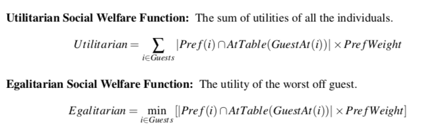

## Project 3: Constraint Assignment

Note that this project will make use of [MiniZinc](https://www.minizinc.org/).  You will need to download and install [MiniZinc](https://www.minizinc.org/) first.

It is highly recommended that you complete the video lectures with Pascal assigned in [Canvas](https://tulane.instructure.com/) before starting on this project.

I have assembled a number of examples of MiniZinc programs and PDFs of my old class where I go into greater detail on various aspects of efficient modeling.  [All these resources are available here](https://drive.google.com/open?id=1vf_0VivlRM1PABX8Jyza7BQWMozTdiH1).

If you really want to go down the rabbit hole there are multiple courses on discrete optimization and modeling available at Cousera given by other members of the old NICTA team.
  * [Discrete Optimization](https://www.coursera.org/learn/discrete-optimization)
  * [Basic Modeling for Discrete Optimization](https://www.coursera.org/learn/basic-modeling)
  * [Advanced Modeling for Discrete Optimization](https://www.coursera.org/learn/advanced-modeling)

### The Assignment

We want to find out if we can seat all of our friends and relatives at our sister's upcoming wedding. Mom says money is a little tight so we need to make sure all the tables that we will order will at least have some people at them.  Every individual, family, or couple that received an invitation should be seated together.  Additionally, each person could suggest people that they would prefer to sit with.  Since this is so important to Mom we want to maximize the happiness she gets out of seeing all her friends and family sitting together happily at the wedding. For this assignment we are going to encode the problem as a constraint programming problem and find solutions so that everyone can have a fun and **happy** time.

#### Formal Problem Description

Formally, there are *nGuests* attending the wedding that must be seated at *nTables*, where each table can seat at most *nSeats* guests. We are also given a list *Groups* of size *nGroups* which tells us which people must be seated together. We are additionally given a list *Pref* of length *nGuests* which tells us which people a guest would **prefer** to sit with. We use an arbitrary, integer utility measure *PrefWeight* which tells us how much happiness each guest derives from sitting next to their preferred guests.  Mom has also given us a set of guests who all must sit at different tables, otherwise they would get too drunk and cause problems.

We want to find a mapping of guests to tables such that:
  * No table has more people at it than *nSeats*.
  * Every table must have at least *Floor(nSeats/2)*  people at it.
  * Every person **must** be seated with their group.
  * Everyone in the set *Trouble* must be seated at different tables.


#### Measures of Utility

We want to investigate different functions we can use to maximize the happiness or **utility** of all the guests at the wedding. We will investigate three different measures of utility. For more in-depth details of welfare and happiness see H. Moulin, [*Fair Division and Collective Welfare*](https://mitpress.mit.edu/books/fair-division-and-collective-welfare), MIT Press, 2004.  

Let *AtTable(t)* denote the set of people seated at table *t*, *Pref(i)* is the set of people *i* prefers to sit with, and *GuestAt(i)* is the table that *i* is seated at.



#### Additional Details

We have included a Python 3.5+ script which, given a properly specified input file, can check a provided
solution.  The command line for the script is: `python3 checkAssignment.py <Input File> <Output File>`.  [The check assignment file can be found with the other project resources](https://drive.google.com/open?id=1vf_0VivlRM1PABX8Jyza7BQWMozTdiH1).

In order to capture the output of your solver try:

```mzn-g12cpx weddingseating.mzn base-example.dzn > base-example.out```

and then:

```$ python3 checkAssignment.py base-example.dzn base-example.out```

to verify your output.

Your solver **must** accept input and display output in the following formats.

**Example Input:**
```
% Wedding Seat Assignment Data File.
%Evaluation (0 = Utilitarian, 1 = Egalitarian)
Evaluation = 0;

%Number of Tables
nTables = 3;

%Number of Seats per Table:
nSeats = 3;

%Number of Guests:
nGuests = 9;

nGroups = 3;
%Groups that Must be seated together
Groups = [
		          {1,3},
          {5,6},
          {8,9}
];

%Pref Weight
PrefWeight = 3;
%Preference Graph: Row i is the person that Guest i would like to sit with.
%There must be as many rows as nGuests.
Pref = [
		        {2,3,4},
        {1,6,9},
        {1,4},
        {3,9},
        {6},
        {5},
        {1,8,9},
        {7,9},
        {4}
];
        
%Troublemakers
Trouble = {2, 3};
```

The above data file will produce the following **Example Output:**

```
Table: Guests: 
   1 : {1,3,4}
   2 : {2,5,6}
   3 : 7..9
Utilitarian Happiness: 36
Egalitarian Happiness: 0
----------
```

If we modify the above file to maximize the egalitarian welfare then we get the following **Example Output:**

```
Table: Guests: 
   1 : {1,3,7}
   2 : {2,5,6}
   3 : {4,8,9}
Utilitarian Happiness: 27
Egalitarian Happiness: 3
----------
```

### What To Turn In!

Turn in through [Canvas](https://tulane.instructure.com/).  You will submit 4 files for grading for this project.
  * `Lastname.weddingseating.mzn` Your MiniZinc model of the problem.  This should be well documented and readable.
  * `Lastname.Example.dzn` An example problem that is **satisfiable** that you have created. It should have at least 20 guests seated at 4 tables.  It should not be trivial, ie., everyone  should not necessarily want to sit with everyone else.
  * `Lastname.out` The output of your model on your created input.  The output should correspond to the output file format.
  * `Lastname.WrittenAnswers.\{pdf, doc, docx\}` This should be a approximately 2 page write-up of your project.  Specifically you should explain: 
    1. What the decision variables are in the model;
    2. Why you chose to model the problem with these decision variables;
    3. An explanation of each of the *constraint* lines in your model. You should be able to explain what the constraint is doing, and what it models in the real world.  Discuss why you chose the modeling approach you did whether you tried any other approaches and whether or not they worked.
    4. You must also include a section called *Testing*.  This section should include:
      a. A graph which shows how your model preforms (in terms of choice points for g12fd or nodes for gecode explored and the solve time) as you add more guests for both of the evaluation functions.  
      b. There should be data points at 5, 10, 20, and 30 guests for each of the welfare functions. 
      c. A short paragraph about how using the different utility functions, the number of guests, and any other constraints you can think of to test did (or did not) affect the solve time of your model.

You should submit a Zip file that contains all of the above components. You should rename the folder (before zipping it) to `Lastname.Project3`. Please make sure to zip and submit **only the files specifically listed here**.

### Grading Rubric

We expect all code to be written in a professional manner. That means there are comments where there needs to be, that the code is written in a general way that is (reasonably) efficient, and that you use naming conventions that others can understand.  If we open your code and we can't understand it, you will lose points even if it works.

* (10 Points) *Professionalism*: You have written code that is interpretable -- it contains comments where needed to understand, variable names are reasonable, and code that is reasonable and efficient.  You have followed directions to turn in the file, clearly labeling everything.  You have cited all sources and how you used them.
* (10 Points) *Example*: The example is the correct size, is satisfiable, and reasonably complex.
* (5 Points) *Output*: Output is present and real.
* (10 Points) *Explanation*: Explanation is present, reasonable, correct length, is written in proper English, and includes required sections.
* (10 Points) *Testing*: Testing is completed as described, explanations are reasonable and correct.
* (10 Points) *Wedding Seating*: Table and size constraints are modeled correctly and reasonably.
* (10 Points) *Groups*: Required groups are seated together and implementation is reasonable.
* (10 Points) *Troublemakers*: Troublemakers are seated correctly and implementation is efficient.
* (10 Points) *Preference Metrics*: Both preference metrics are implemented and there is a switch that is implemented reasonably.
* (15 Points) *Efficiency/Model*: The model implemented is of high quality, breaks symmetries where necessary, and can solve large instance.
* Total Score: 100 (divided by 2).